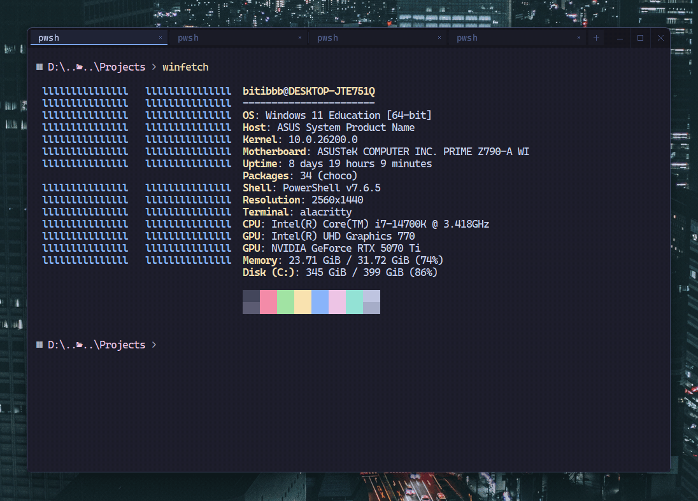
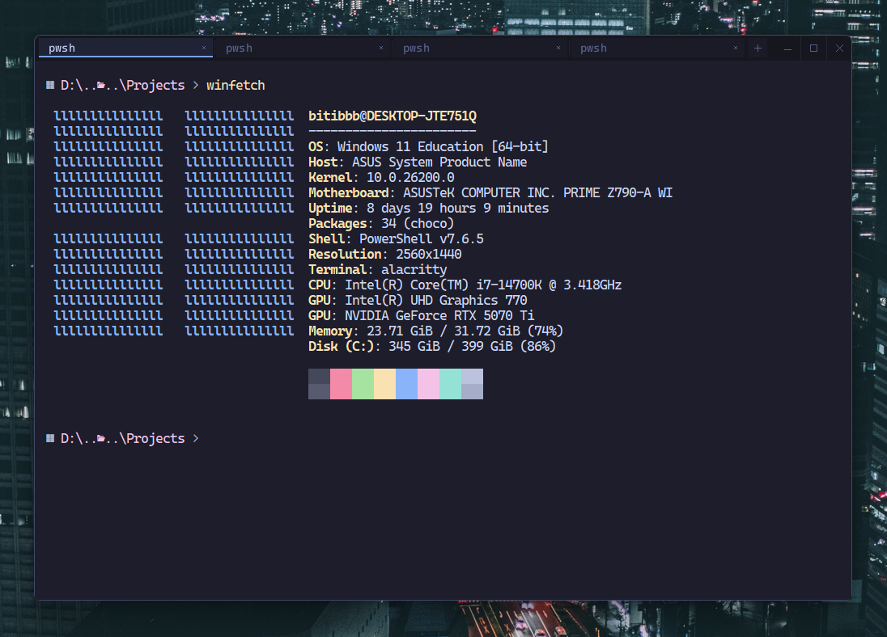

<div align="center">
  
</div>

# uvez

[](https://github.com/bbitibb/uvez/actions/workflows/ci.yml)

A lightweight, tabbed container for Windows that groups standalone application windows into a single window with a native-feeling tab bar.

Currently configured for **Alacritty**, but built on generic Win32 window management to support any native top-level application.

> **Why "uvez"?** From the Serbian/Croatian - *binding, grouping* - which is exactly what it does to your windows.



---

## What it does

Instead of relying on terminal-specific tab implementations or tiling window managers, `uvez` acts as a lightweight host frame:

- **Borderless hosting**: Strips native window chrome (`WS_CAPTION`, `WS_THICKFRAME`) and aligns the guest window inside the container.
- **Zero-lag drag sync**: Uses Win32 window subclassing and atomic Z-order lifting so the hosted window moves 1:1 with the host frame without stutter or lag.
- **Clean Alt+Tab / Taskbar integration**: Makes hosted guest windows owned by the container, so they group under Uvez and never appear as separate Taskbar or Alt+Tab entries.
- **Software-rendered tab bar**: A minimal tab strip rendered via `softbuffer` and `fontdue` (Cascadia Code) that only redraws on state changes.
- **MRU Tab Switching**: `Ctrl + Tab` toggles between your most recently used tabs first.

The guests are real, unmodified applications - `winfetch` inside a hosted tab reports `Terminal: alacritty`:



---

## Controls

| Action | Input |
|---|---|
| **New tab** | `Ctrl + T` or `Left Click` on `+` |
| **Switch to recent tab (MRU)** | `Ctrl + Tab` |
| **Switch tab** | `Left Click` on tab |
| **Reorder tabs** | Drag a tab left or right |
| **Close tab** | `Ctrl + Shift + W`, `Middle Click` on tab or `Left Click` on `×` |
| **Detach tab** | `Left Click` on `↗` on a tab or `Ctrl + Alt + D` |
| **Attach focused window** | `Ctrl + Alt + A` |
| **Minimize / Maximize / Close** | Buttons in the top-right of the tab strip |
| **Move window** | Drag the empty tab strip |
| **Maximize / restore** | Double-click the empty tab strip |
| **Close all** | Close button or host window close |

---

## Getting Started

### Prerequisites
- Windows 10 / 11
- [Rust](https://www.rust-lang.org/) (2024 edition)
- for current config: [Alacritty](https://alacritty.org/) (installed and available on `PATH`)

### Run
```bash
cargo run --release
```

---

## Diagnostics

Uvez is a GUI-subsystem application and prints nothing by default.

- **Development builds** (`cargo run`) always log to stderr.
- **Release builds**: set the `UVEZ_DEBUG` environment variable to write
  a session log to `%TEMP%\uvez-debug.log` (fresh on every launch).

```powershell
$env:UVEZ_DEBUG = "1"; .\target\release\uvez.exe
```

When reporting a bug, attach that log file.

## Roadmap

- [ ] TOML configuration file for custom app launch profiles and args
- [ ] Detach tabs back into standalone windows on demand
- [ ] Attach already-running windows by PID / title
